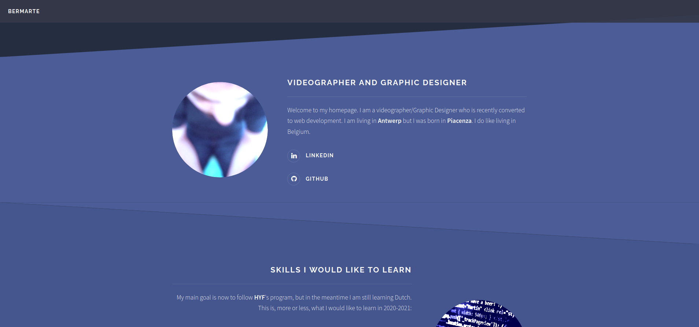

# bermarte.github.io

### my homepage

A simple homepage built using a template (Solid State) provided by HTML5 UP. 

[Backlog](./project-planning/backlog.md) 

[Development strategy](./project-planning/development-strategy.md)  

  

