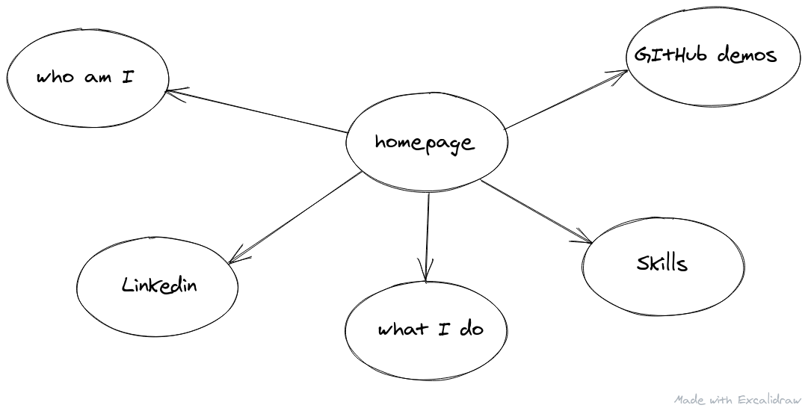
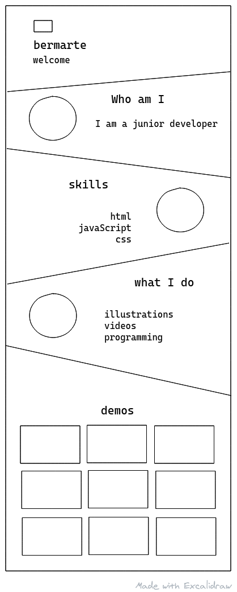

# Portfolio

---

## Data

> describe the data used in your project.
>
> - what properties?
> - what types?
> - what are array entries like?

---

## User Story Dependencies

  

---

## WIREFRAME

  

## 0.Setup

The project is built on an existing repo,
so all the HTML and the CSS are already provided. This is why this development strategy is a bit different than usual. 

---

## 1. Github repos 

**As a user I want to see some examples made by the developer**

- This user story is developed on branch `githubapi`.
- This branch is merged to `master` branch after completion.

- `index.html`
- `github.css`
- `getRepo.js` (class)
- `loadGit.js` (handler)
- `domListener.js` (listener)
- `data.js` (data)
- `init.js` (main entry)
---
## 2. Documentation
**As a user I want to read what this project is about**

- This user story is developed on branch `master`.

- `README`
- `backlog.md`
- `development-strategy.md`

- Logging the functions is also part of the documentation
- Using JsDoc's comments to document the functions used